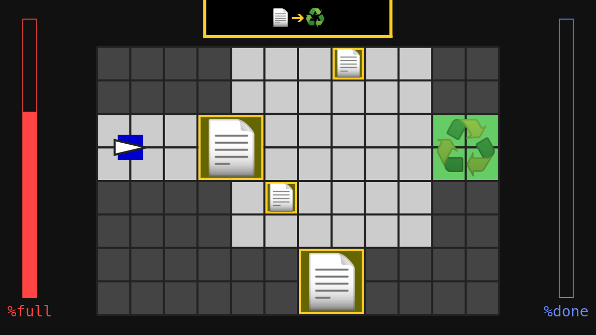

# HDD Liberator

HDD Liberator is a game for JS13K 2021. The game takes only 7580 bytes, compressed!

Play the game online: https://www.moria.us/demos/hdd-liberator/



> You remember the old days. 1.44 MB floppy disks. 2400 baud modems crawling across the screen, line by line.
>
> You gave them terabytes in a single drive, exabytes in the cloud, and fiber-optic networks.
>
> It’s never enough.

JS13K 2021 entry: https://js13kgames.com/entries/hdd-liberator

GitHub release: [Version 1.0.0](https://github.com/depp/hdd-liberator/releases/tag/v1.0.0).

## Building

Requirements: Bazel, NPM. Bazel and NPM will both fetch what they need in order to run. This includes Go and Java toolchains... be warned.

```shell
$ npm install
$ bazel run -c opt //build/devserver
```

Or,

```shell
$ npm install
$ bazel run -c opt //build/archive
```

## Running Tests

```shell
$ npm run test
```
